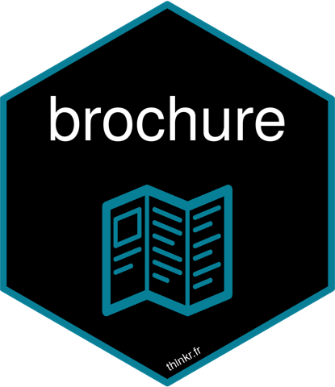

<!-- README.md is generated from README.Rmd. Please edit that file -->

# brochure 

<!-- badges: start -->

[](https://lifecycle.r-lib.org/articles/stages.html#stable)
[](https://github.com/ColinFay/brochure/actions/workflows/R-CMD-check.yaml)
<!-- badges: end -->

> Build natively multi-page `{shiny}` applications.

A `{shiny}` app is a single page: one url, one UI, one server function.
`{brochure}` makes it several. You declare a `page()` with its own href,
its own UI and its own server function, and the request is dispatched to
it by [`{routr}`](https://routr.data-imaginist.com/) — including
parameterised routes such as `/user/:id`. Redirections, request and
response middleware, and cookie helpers come with it.

**Disclaimer**: building an app with `{brochure}` is different from the
way you usually build `{shiny}` apps, as you no longer operate under the
single page app paradigm. `vignette("design")` covers what changes.

## Installation

``` r
remotes::install_github("ColinFay/brochure")
```

`{brochure}` exports `page()`, which masks `utils::page()`:

``` r
library(brochure)
#> 
#> Attaching package: 'brochure'
#> The following object is masked from 'package:utils':
#> 
#>     page
```

## A minimal app

Each page has its own url, its own UI, its own server function, and its
own Shiny session. The server is optional if the page is static.

``` r
library(shiny)
library(brochure)

brochureApp(
  page(
    href = "/",
    ui = fluidPage(
      h1("Home"),
      plotOutput("plot"),
      tags$a(href = "/contact", "Contact us")
    ),
    server = function(input, output, session) {
      output$plot <- renderPlot({
        plot(iris)
      })
    }
  ),
  page(
    href = "/contact",
    ui = fluidPage(
      h1("Contact"),
      tags$p("No server function in this one.")
    )
  ),
  redirect(from = "/index.html", to = "/")
)
```

Run it as you would any Shiny app, then navigate to `/` and to
`/contact`. Moving from one page to the other is a plain link: the
browser leaves the first page and opens a new session on the second one.

A parameterised href matches one segment, and the page reads what it
matched with `get_keys()`:

``` r
page(
  href = "/user/:id",
  ui = function(request) {
    fluidPage(h1(paste("User", get_keys(request)$id)))
  },
  server = function(input, output, session) {
    message("Serving user ", get_keys()$id)
  }
)
```

## User documentation

Everything lives at <https://colinfay.me/brochure/>.

- [Get started](https://colinfay.me/brochure/articles/brochure.html) —
  pages, routing, what every page shares, and reading url parameters
- [Handlers](https://colinfay.me/brochure/articles/handlers.html) — the
  request and response middleware, logging, healthchecks, answering
  before Shiny
- [Cookies](https://colinfay.me/brochure/articles/cookies.html) —
  setting, reading and removing cookies, and carrying a session between
  pages
- [Deployment](https://colinfay.me/brochure/articles/deployment.html) —
  serving the app under a prefix, behind a reverse proxy or on Posit
  Connect
- [golem](https://colinfay.me/brochure/articles/golem.html) — building a
  brochure app as a `{golem}` package

## Technical documentation

- [Function
  reference](https://colinfay.me/brochure/reference/index.html)
- [Design](https://colinfay.me/brochure/articles/design.html) — what
  changes when an app is several pages: where state goes, what a
  navigation costs, and when not to reach for `{brochure}`
- [Testing](https://colinfay.me/brochure/articles/testing.html) —
  testing the routing, the responses and the page servers
- [Changelog](https://colinfay.me/brochure/news/index.html)
- [Source](https://github.com/ColinFay/brochure) and
  [issues](https://github.com/ColinFay/brochure/issues)

## Previous work

Other packages implement features that are close to what `{brochure}`
does:

- [`{shiny.router}`](https://www.appsilon.com/post/shiny-router-020)
- [`{blaze}`](https://github.com/nteetor/blaze)

As far as I can tell, they do not serve the same goal, as they both
still serve Single Page Applications.
